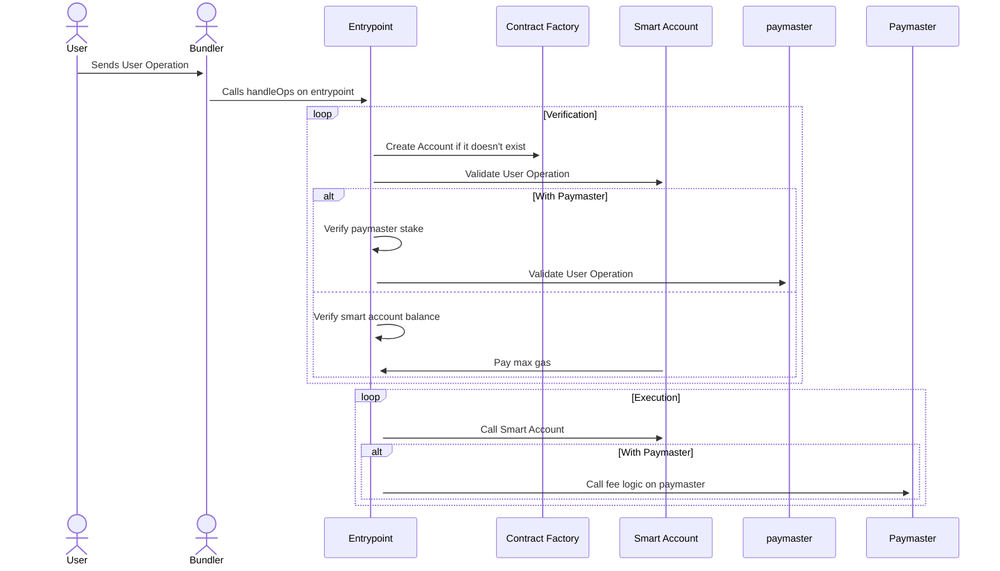
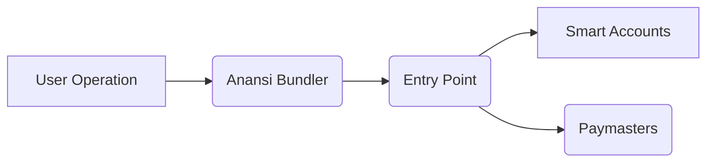

# Anansi: The Secure and Seamless Crypto Wallet for the Future

## Table of Contents
- [Overview](#Overview)
- [Architecture Diagram](#Architecture-Diagram)
- [Project Breakdown](#Project-Breakdown)
  - [ERC-4337](#ERC-4337)
  - [Anansi Wallet](#Anansi-Wallet)
- [Project Flow](#Project-Flow)
- [Project Highlights](#Project-Highlights)
- [Getting Started](#Getting-started-with-Anansi-Wallet)
- [Technologies Stack](#Technologies-Stack)
- [Deployed Contracts (Account Abstraction)](#Deployed-Contracts-Account-Abstraction)
- [Conclusion](#Conclusion)
- [Envisioning the Future](#Envisioning-the-Future)
- [Team](#Team)
- [Demos](#Demos)
***

## Overview

Anansi is a secure and user-friendly crypto wallet designed for the future. It eliminates private key management with secure passkey login and offers gas-free transactions (Botanix testnet), simplifying your crypto journey. Built on cutting-edge technology, Anansi leverages ERC-4337 standards, showcasing the power of Account Abstraction implemented on the Botanix blockchain (Bitcoin Layer 2).

## Architecture Diagram

## Project Breakdown:

**Anansi leverages several key components to deliver its innovative features:**

  ### ERC-4337

Our team implemented the [ERC-4337](https://eips.ethereum.org/EIPS/eip-4337) standard on the Botanix blockchain, enabling advanced account abstraction features and a smoother user experience.

### Anansi Wallet

The Anansi wallet is a user-facing application built on top of our [ERC-4337](https://eips.ethereum.org/EIPS/eip-4337) implementation. It provides a secure and intuitive interface for users to manage their crypto assets.

## Project Flow

1. User creates a new wallet using a secure passkey login (no mnemonics needed).
2. Each smart account is bound to a unique name which is registered on our smart contracts.
3. User interacts with the Anansi wallet interface to send and receive crypto on the Botanix blockchain.
4. Transactions are processed through our ERC-4337 implementation on Botanix, ensuring security and efficiency.

## Project Highlights

* Secure passkey login eliminates the need for managing private keys.
* Gas-free transactions on the Botanix testnet (testnet).
* Innovative implementation of ERC-4337 on the Botanix blockchain.
* Multi-chain support planned for future iterations.
* Simple Name Service to facilitate crypto transactions
* Recover smart account (Google OAuth 2.0)
* Modern and minimalistic user interface.

## Getting started with Anansi Wallet
Ready to explore the future of crypto wallets? Here's how to get started with Anansi:

1. Visit [Anansi Website](https://aanansi.xyz/).
2. Create a new wallet using a secure passkey login. No need to manage complex mnemonics!
3. Fund your wallet with your testnet faucet.
4. Start sending, receiving, and managing your crypto assets with ease.

## Technologies Stack:

* Solidity (Smart contract development)
* Next.js (Front-end development framework)
* Turnkey (Secure private key storage)

## Deployed Contracts (Account Abstraction)

**[Entrypoint - 0x0000000071727De22E5E9d8BAf0edAc6f37da032](https://blockscout.botanixlabs.dev/address/0x0000000071727De22E5E9d8BAf0edAc6f37da032)**   

**[Account Factory - 0x4729CCf7a9c43F83A3cdc7B666DBb53adc9cc851](https://blockscout.botanixlabs.dev/address/0x4729CCf7a9c43F83A3cdc7B666DBb53adc9cc851)**   

**[All Inclusive Paymaster - 0xc523FF9698230096d4aDa45D52FA0063E109618D](https://blockscout.botanixlabs.dev/address/0xc523FF9698230096d4aDa45D52FA0063E109618D)**   

**User operation bundler: [Anansi Bundler](https://bundler.aanansi.xyz/)**   

## Conclusion

Anansi is a groundbreaking crypto wallet application that prioritizes security and user experience. By leveraging cutting-edge technologies and fostering a multi-chain future, Anansi empowers users to explore the world of cryptocurrency with confidence.

## Envisioning the Future

The Anansi team is committed to continuous innovation. We plan to expand Anansi's functionality to support additional blockchains and integrate advanced features that further enhance user experience and security.

## Team
[Sam](https://github.com/meisamtaher)   
[Max](https://github.com/0xmaxyz)   

## Demos
- [Anansi Wallet](https://aanansi.xyz/)   
- [Youtube](https://youtu.be/xxxxxxxxxxx)   
